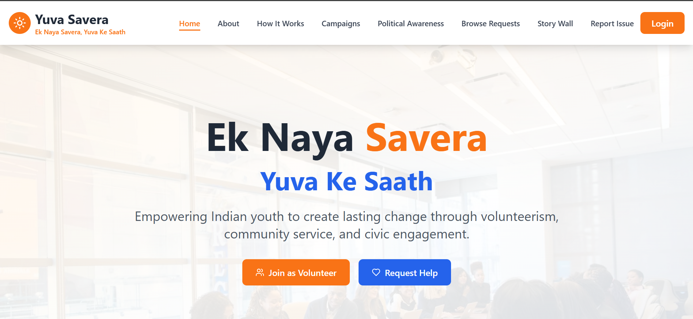

# Yuva Savera – NGO Website
A full-stack website built for an NGO to showcase initiatives, spread awareness, and provide information about their mission and activities. The platform offers a clean UI, organized content, and backend support for future expansion such as donations, forms, and dynamic data handling.

## Live Demo
https://yuva-saveraaa.vercel.app/

## Features
- Informational pages about the NGO  
- Clean and responsive UI  
- Modern and minimal design  
- Component-based architecture  
- Backend ready for API integration  
- Secure and scalable structure  

## Screenshot

## Technologies Used
### Frontend
- React.js  
- Vite  
- Tailwind CSS  
- JavaScript  
- HTML5 & CSS3  
- Vercel Deployment  

### Backend
- Node.js  
- Express.js  
- MongoDB  
- Mongoose  
- REST API Architecture  

## Folder Structure
### Yuva_Savera_Frontend/
- src/  
  - assets/  
  - components/  
  - pages/  
  - utils/  
  - App.jsx  
  - index.css  
  - main.jsx  
- index.html  
- package.json  
- tailwind.config.js  
- vite.config.js  

### Yuva_Savera_Backend/
- assets/  
- config/  
- controllers/  
- middlewares/  
- models/  
- routes/  
- utils/  
- package.json  
- server.js  

## How to Use
1. Visit the website  
2. Navigate through the About, Mission, and Activities sections  
3. Explore the organized content and UI  
4. Backend supports expansion for forms, donations, and dynamic content  

## What I Learned
- Structuring large-scale frontend and backend projects  
- Component-based UI building with React  
- Tailwind CSS for clean and responsive layouts  
- REST API structure for scalable backends  
- Deploying frontend and backend separately  
- Maintaining clean folder organization  

## Author
**Shruti Rawat** 
Web Developer
